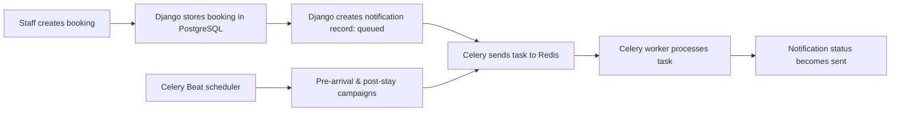

# Hotel Notification Hub

An MVP notification management system for a multi-property luxury hotel group.

## Technology stack

- **Frontend:** React and Vite for the hotel operations dashboard.
- **Backend:** Django and Django REST Framework for the admin portal and REST APIs.
- **Database:** PostgreSQL for hotels, guests, bookings, templates, preferences, and notification history.
- **Asynchronous processing:** Celery for background notification jobs and scheduled campaigns.
- **Message broker / cache:** Redis for the Celery task queue and task-result backend.
- **Infrastructure:** Docker Compose runs the frontend, backend, PostgreSQL, Redis, Celery worker, and Celery Beat services together.

## How the notification system works

1. When staff create a booking through Django Admin or the REST API, Django stores it in PostgreSQL.
2. A Django signal automatically creates a **booking confirmation** notification, respecting the guest's email consent preference.
3. The notification begins with status `queued`. Celery places a delivery task into Redis instead of making the user wait for delivery work.
4. A Celery worker takes that task from Redis, simulates delivery in this MVP, then updates the notification to `sent`, including its delivery time and attempt count.
5. Celery Beat runs scheduled checks for **pre-arrival** messages (one day before check-in) and **post-stay** messages (on checkout day). It creates each campaign notification only once per booking.
6. Each hotel can create its own templates using placeholders such as `{guest_name}`, `{hotel_name}`, and `{confirmation_code}`.

> This version simulates message delivery. In production, the Celery task would call an email provider such as Amazon SES/SendGrid, an SMS provider such as Twilio, or a push-notification provider.

## What it does

- Keeps hotels, guests, bookings, templates, and notification delivery records in one place.
- Creates automated booking confirmation, pre-arrival, and post-stay notifications.
- Supports per-property templates, email/SMS/push consent preferences, delivery attempts, and retries.
- Sends work to Celery in the background; the MVP simulates delivery and records the result.
- Provides a React dashboard to see hotels and recent notifications.

## Run it

1. Install Docker Desktop and start it.
2. From this folder run `docker compose up --build`.
3. Open `http://localhost:5173` for the dashboard and `http://localhost:8000/api/` for the API.
4. Create an admin user: `docker compose exec backend python manage.py createsuperuser`, then visit `http://localhost:8000/admin/`.

## Testing

Run `docker compose exec backend coverage run manage.py test` followed by `docker compose exec backend coverage report`.

## Important next steps before production

Connect an approved email/SMS vendor, secure secrets in environment variables, add login/role permissions, and integrate the hotel PMS/booking system. Do not send promotional messages without recorded guest consent.
